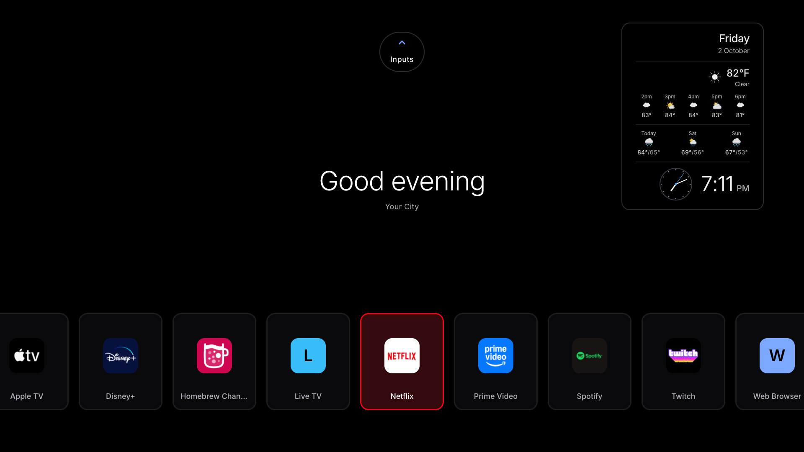
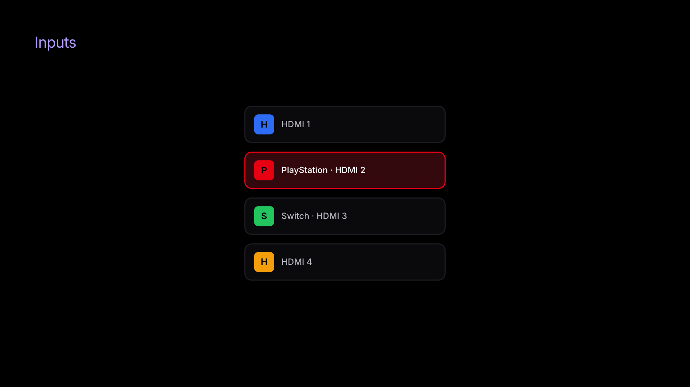
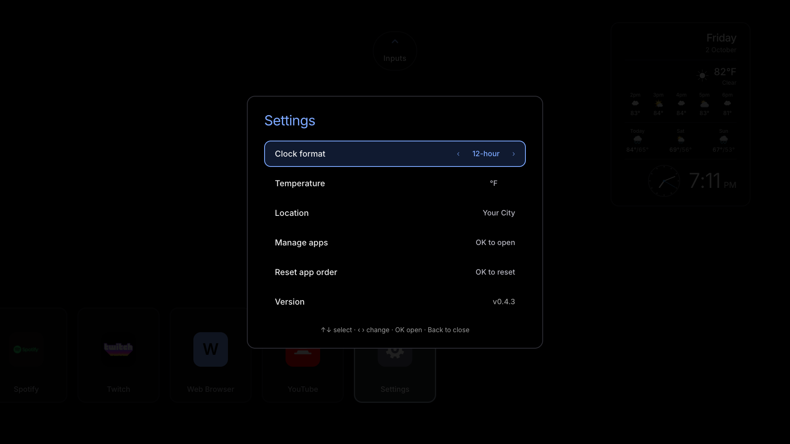
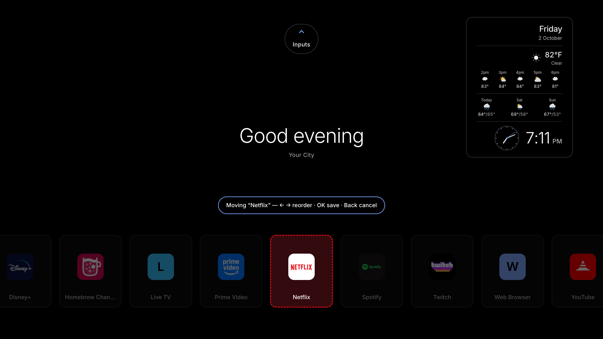

# Custom webOS Home

A replacement home screen for LG webOS TVs — no ads, no recommendation rows, no
carousel of things you'll never watch. Just your installed apps, your HDMI inputs,
a clock, and the weather, on a pure-black OLED background.

It runs as a sideloaded web app and (optionally) takes over the **Home button** and
**boot** so the TV comes up straight into it. Everything lives inside the app
package: it bind-mounts nothing, edits no OS files, and a plain uninstall reverts
the TV completely.



> **Tested on:** an LG TV on **webOS 6.5.3 (Chromium 79)** — the oldest engine the
> build targets. The project was originally built and proven on an LG OLED with
> webOS 24 (Chromium 108); the current layout and build have not been re-tested
> there. The Home-button key code may differ per remote (see
> [Troubleshooting](#troubleshooting)).

---

## What you get

- **Your apps on the home screen** — every app installed on the TV, read live from
  the TV's launcher (A→Z), in a rail along the bottom. Nothing is hard-coded:
  install or remove an app and the rail follows.
- **Inputs** — the TV's HDMI inputs on their own screen above home, using the names
  you gave them in the TV's menu.
- **OLED-first look** — a pure-black page (those pixels are off, which keeps the
  panel cool), solid surfaces and hard-edged focus borders. No animated background,
  glows or soft shadows.
- **Real launches** — tiles launch the installed apps and switch HDMI inputs via
  LunaService (`applicationManager/launch`).
- **Widgets** — analog + digital clock, date, and current weather with an hourly and
  3-day outlook from [Open-Meteo](https://open-meteo.com/) (no API key). Set your
  city in **Settings → Location** (city search, saved on-device) — no rebuild needed.
- **Reorder & hide** — hold **OK** to reorder tiles; hide apps or inputs you don't
  want under **Settings → Manage apps**. Both persist on the TV.
- **The TV's own screensaver** — the app has no screensaver of its own and does not
  block the TV's.
- **eARC audio guard** — keeps audio on your configured output (e.g. an eARC/ARC
  receiver), which a bare app launch or a cold power-cycle can otherwise drop to
  the TV speakers. It *subscribes* to the live sound output and re-asserts the
  moment it drifts, and keeps retrying through the cold-boot window while the
  receiver's eARC link is still coming up. See
  [`src/service/luna.ts`](src/service/luna.ts).
- **Home button + autostart** — an in-package LunaService watches the remote's
  HOME key and relaunches the app; a webosbrew init.d hook boots into it. See
  [How the Home takeover works](#how-the-home-takeover-works).

## Screens and remote keys

| Where | Key | What it does |
|---|---|---|
| Home | **Left / Right** | Move through the app rail (stops at either end) |
| Home | **Up** | Open **Inputs** |
| Inputs | **Up / Down** | Pick an input; running past either end returns home |
| Inputs | **Back**, **Left / Right** | Return home |
| Either | **OK** (short) | Launch the focused app / switch to the input |
| Either | **OK** (hold) | Reorder: arrows move the tile, **OK** saves, **Back** cancels |

**Settings** is the last tile in the app rail.

| Inputs | Settings |
|:---:|:---:|
|  |  |

Hold **OK** on any tile to reorder it:



> The screenshots are rendered from the real build in a desktop browser with a
> simulated TV (sample apps and input names), not captured from a TV.

## Tech stack

Vite + React + TypeScript + Tailwind v4 + Framer Motion, packaged with the
webOS `ares` CLI.

> **Critical build detail:** the oldest supported engine is **Chromium 79**
> (webOS 6), far below Tailwind v4's native baseline (Chrome 111). The build
> closes that gap in two steps — **do not remove either** or the panel renders
> unstyled:
>
> 1. [`vite-plugin-legacy-css.ts`](vite-plugin-legacy-css.ts) rewrites the final
>    stylesheet: flattens `@layer`, applies the `--tw-*` defaults without
>    `@property`, adds `transform` fallbacks for `translate`/`scale`/`rotate`,
>    expands `:is()`/`:where()` and `padding-inline`/`-block`, and emits a
>    margin fallback for flexbox `gap` (switched on at runtime by the
>    `no-flex-gap` class set in [`src/main.tsx`](src/main.tsx)).
> 2. **Lightning CSS** then downlevels to `chrome >= 79`: modern color functions
>    (`oklch()`, `color-mix()`) → hex, `inset`→`top/right/bottom/left`, media-query
>    ranges→`min-width`.
>
> JavaScript is compiled to `chrome79` by esbuild (`?.` and `??` need Chrome 80).
> It ships as one classic `<script defer>` (IIFE, no `type="module"`, no
> `crossorigin`): the app loads from `file://`, where old engines block module
> scripts with a CORS error and show only a black screen.
>
> When styling, keep to what the fallbacks cover: use `gap-*` utilities on a
> `flex` container (never inline `gap`), don't put margin utilities on its direct
> children, and avoid inline `inset`, `aspect-ratio`, `translate`/`scale`/`rotate`.

---

## Quick install (one-click)

Don't want to build anything? If your TV is already
[rooted](https://github.com/webosbrew/webos-homebrew-channel) with SSH enabled,
grab the launcher for your OS from the
[**latest release**](https://github.com/marc-fischer/webos-custom-home/releases/latest)
and run it — it asks for your TV's IP and does the rest --install + boot autostart
+ HOME-button takeover-- over SSH. No Node, no `ares` CLI, no building.

| Your computer | File | How to run |
|---|---|---|
| **Windows 10/11** | `install.bat` | Double-click |
| **macOS** | `install.command` | Double-click (right-click → Open the first time) |
| **Linux / WSL / Git Bash** | `install.command` | `bash install.command` |

Or, from any terminal, the same thing as a one-liner:

```bash
ssh root@<TV_IP> "curl -fsSL https://github.com/marc-fischer/webos-custom-home/releases/download/v0.4.3/tv-install.sh | sh"
```

See [`installer/`](installer/) for details and the uninstaller. Prefer the
classic `ares` sideload? `ares-install --device tv <the .ipk from the release>`.

> **eARC receiver losing audio on power-on?** Some LG TVs bring an eARC/ARC AV
> receiver up *desynced* after a cold boot or standby-wake — the TV shows the
> receiver as the sound output but nothing comes through, and you have to toggle
> eARC off/on by hand each time. The **eARC edition** fixes this automatically: its
> bundled service re-handshakes the eARC link ~10s after every boot and wake. It
> elevates the service (via the Homebrew Channel's own `elevate-service`) and causes
> a brief (~2s) audio blip on each power-on, so it's a **separate opt-in download** —
> use it only if you have this exact problem:
>
> ```bash
> ssh root@<TV_IP> "curl -fsSL https://github.com/marc-fischer/webos-custom-home/releases/download/v0.4.3/tv-install-earc.sh | sh"
> ```
>
> Everyone else should use the standard install above (it never touches eARC).

The app starts on a placeholder location — **set your own city right in the app**
(Settings → Location → search), no rebuild needed. The app list needs no setup: it
is read from the TV.

---

## Prerequisites

1. **A rooted / dev-mode LG webOS TV.** Root via the
   [Homebrew Channel](https://github.com/webosbrew/webos-homebrew-channel) is
   recommended (needed for boot autostart). Plain LG Developer Mode works for
   sideloading and running, but **not** for boot persistence — see
   [`docs/TUTORIAL.md`](docs/TUTORIAL.md).
2. **Node.js 18+** on your computer.
3. **The webOS CLI:** `npm i -g @webos-tools/cli` (provides `ares-*`).
4. **An ares device profile** pointing at your TV — see below.

## Setup

```bash
git clone https://github.com/marc-fischer/webos-custom-home.git
cd webos-custom-home
npm install
```

### Point ares at your TV

Register your TV once (root SSH key or dev-mode passphrase):

```bash
ares-setup-device        # interactive: add a device named e.g. "tv" @ your TV's IP
ares-setup-device --list # confirm it's there
```

The deploy script assumes the profile is called **`tv`** and reads the TV's IP
for the post-install autostart step. Override either without editing code:

```bash
TV_DEVICE=mytv TV_IP=192.168.1.50 npm run deploy
```

### Configure what shows up

Most things are set on the TV itself: location, clock format and temperature unit in
**Settings**; tile order by holding **OK**; hidden apps under **Settings → Manage
apps**. The code only needs touching for:

| What | Where |
|------|-------|
| Artwork for known apps (brand color + bundled icon) | [`src/lib/apps.ts`](src/lib/apps.ts), [`public/icons/`](public/icons/) |
| Default weather location (before one is picked in Settings) | [`src/lib/config.ts`](src/lib/config.ts) |
| HOME remote key code | `HOME_CODE` in [`service/service.js`](service/service.js) |

> **Where the lists come from.** A sandboxed web app may not be allowed to ask the
> system for the launcher's contents (it isn't on webOS 6). So the app asks its own
> background service ([`service/service.js`](service/service.js)), which runs as
> root when started by `autostart.sh`: `listApps` reads
> `applicationManager/listLaunchPoints` and copies each app's icon into this app's
> own folder (web apps can't read other apps' files); `listInputs` reads
> `com.webos.service.eim/getAllInputStatus`. If the service can't be reached the app
> tries the system calls directly; if inputs can't be read it shows HDMI 1–4.
> Apps without a readable icon get a letter tile.

---

## Develop

```bash
npm run dev        # design in a desktop browser (luna calls no-op off-TV)
npm run typecheck  # TypeScript check of the app and the build config
```

Off the TV the app shows a small set of sample apps and HDMI 1–4.

To check a change against the oldest engine, build and open `dist/index.html`
**from disk** (`file://`, as the TV loads it) in a Chromium 79 build — serving it
over `http://` hides the module-script problem described under
[Tech stack](#tech-stack).

## Deploy to the TV

```bash
npm run deploy   # build → package → install → launch + re-arm Home watcher
```

`npm run deploy` ([`scripts/deploy.mjs`](scripts/deploy.mjs)) does the whole
loop. It packages the web app (`dist/`) **and** the service together with
`ares-package --no-minify` (ares' legacy minifier chokes on Vite's modern output;
Vite already minifies), installs, then runs the service's `autostart.sh` over SSH
— because `ares-install` kills the running service, and without re-arming it the
Home button stays dead until the next reboot.

Manual equivalent:

```bash
npm run build
ares-package dist service -o . --no-minify
ares-install --device tv tld.my.customhome_*.ipk
ares-launch  --device tv tld.my.customhome
```

---

## How the Home takeover works

Making a sideloaded app the *real* Home on webOS is normally impossible — Home is
a signed, read-only Flutter app. This project sidesteps that without touching any
OS files:

- **A registered in-package LunaService** ([`service/service.js`](service/service.js)).
  Registration is what grants it permission to call `applicationManager/launch`
  (a bare script can't). It:
  - `--boot`: on cold boot, launches the app, retrying until the app manager is
    ready.
  - `--watch`: does a **non-blocking poll** of every `/dev/input/event*` device
    and relaunches the app when it sees the HOME key (code `773` on this remote).
    (Non-blocking is essential — blocking reads across ~32 input nodes exhaust
    libuv's 4-thread pool and starve the device that actually carries HOME.)
  - A 1s heartbeat detects **wake-from-standby** (a big wall-clock gap) and
    relaunches, since init.d autostart only fires on cold boot.
  - Answers the web app's `listApps` / `listInputs` requests (see
    [Configure what shows up](#configure-what-shows-up)).
- **A webosbrew init.d hook** ([`service/autostart.sh`](service/autostart.sh)),
  symlinked into `/var/lib/webosbrew/init.d/`, starts that service at boot.

Uninstalling the app (and removing the init.d symlink) restores stock behavior.
Nothing here is destructive.

## Troubleshooting

- **Home button does nothing / app doesn't relaunch** — your remote's HOME key
  code may differ from `773`. SSH in, run `cat /dev/input/event*` (or the
  project's capture approach), press HOME, and read the code; set `HOME_CODE` in
  [`service/service.js`](service/service.js).
- **Black screen, nothing else** — the script didn't run. On old engines that is
  usually a `type="module"` script loaded from `file://`; confirm
  [`vite.config.ts`](vite.config.ts) still has `classicScript()` and the `iife`
  output format, then rebuild. To see the real error, run
  `ares-inspect --device tv --app tld.my.customhome` with the app open.
- **Colors look wrong, or the screen is unstyled** — the CSS downlevel isn't
  running. Confirm [`vite.config.ts`](vite.config.ts) still uses `legacyCss()` and
  targets `chrome >= 79`, then rebuild.
- **"Couldn't read the installed apps"** — the background service isn't running as
  root, or is still the old version. Reboot the TV or re-run `autostart.sh` (as
  `npm run deploy` does). The message names what was refused; the service logs to
  `/tmp/home-svc.log` on the TV.
- **Letter tiles instead of app icons** — same cause: the icons are copied by the
  root service.
- **"Failed to minify code" when packaging** — you dropped `--no-minify`. Keep it.
- **Home dies after every deploy** — the install killed the service and it wasn't
  re-armed. `npm run deploy` handles this; if deploying manually, re-run
  `autostart.sh` on the TV afterward.
- **A tile won't launch** — the toast names the app; check that it still opens from
  the TV's own launcher.

## Credits

- Based on the original **webOS Custom Home** by
  [zzeppieri](https://github.com/zzeppieri/webos-custom-home), which this project is
  forked from.
- Weather data from [Open-Meteo](https://open-meteo.com/).
- Built on the [webOS Homebrew](https://www.webosbrew.org/) project's tooling.

## License

[MIT](LICENSE). Bundled third-party app icons under `public/icons/` are the
property of their respective owners and are included only for interoperability;
replace them with your own if you prefer.
